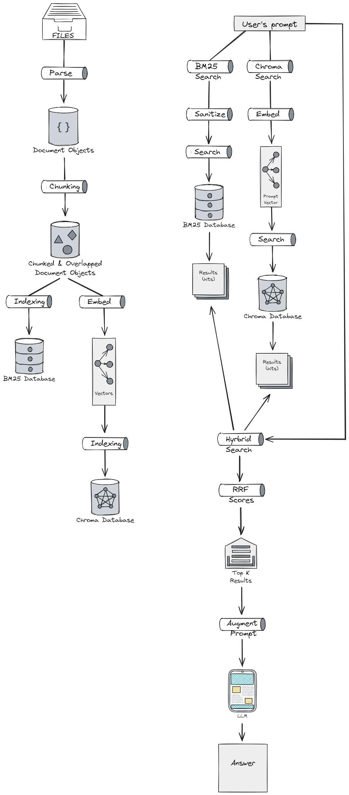

# Windows Contextual Search

Windows Contextual Search is a fully local retrieval and reasoning system built around FastAPI, LangChain, and a local LLM (via Ollama).
It indexes text, PDF, and other supported documents, then allows you to search them contextually through either a web interface or a Windows desktop app.
The entire pipeline runs offline — no remote API calls or cloud dependencies.

---

## Overview

The system combines two retrieval methods:

* **BM25 (keyword-based)** — precise, token-level search through a local SQLite FTS5 index.
* **Chroma (embedding-based)** — semantic similarity search using dense vector representations.

Queries are automatically routed through a **hybrid retriever** that fuses both scores using Reciprocal Rank Fusion (RRF).
Depending on the query intent, the router decides between:

* *File lookup* (show files and snippets), or
* *LLM-based Q&A* (generate an answer with citations from retrieved chunks).

Everything is served through a FastAPI backend, with two optional front-ends:

1. **Web UI** – accessible in any browser.
2. **Windows desktop app** – a native WPF interface for local users.

Flow


---

## Features

* Local-only document search and LLM reasoning
* Fast hybrid retrieval (BM25 + Chroma)
* Llama3 integration via Ollama
* Full-text and semantic ranking with RRF fusion
* Folder picker for workspace selection
* Indexing endpoints for BM25 and Chroma
* Clickable citations that open files directly
* Windows GUI built with WPF (.NET 8)

---

## Folder Structure

```
WindowsContextualSearch/
├── api/                  # FastAPI schemas and response models
├── core/
│   ├── agents/           # Router and LLM agent logic
│   ├── indexing/         # Index creation (BM25 / Chroma)
│   ├── retrieval/        # Hybrid retrieval and answer generation
│   └── utils/            # Logging and support functions
├── gui/
│   └── WindowsContextualSearchApp/  # Native WPF desktop interface
├── web_ui/               # Static web interface (optional)
├── index_store/          # Stored indexes and metadata
├── server.py             # Main FastAPI entrypoint
├── Dockerfile            # Optional web version container
├── setup.bat             # One-time setup for environment
├── start.bat             # Launch API + web UI
└── requirements.txt      # Python dependencies
```

---

## Installation

### Prerequisites

* Python 3.11 or newer
* Ollama installed locally with `llama3` pulled (`ollama pull llama3`)
* .NET 8 SDK (for building the Windows GUI, optional if using web UI)

### 1. Clone the repository

```bash
git clone https://github.com/<yourname>/WindowsContextualSearch.git
cd WindowsContextualSearch
```

### 2. Install dependencies

```bash
pip install -r requirements.txt
```

### 3. (Optional) Create and activate a virtual environment

```bash
python -m venv venv
venv\Scripts\activate
```

---

## Setup and Startup Scripts

Several helper scripts are included to simplify installation and runtime.
All scripts can be run directly by double-clicking them in Windows or from PowerShell.

#### `setup.bat`

Initializes the local environment:

* Creates a virtual environment (`venv`)
* Installs all dependencies from `requirements.txt`
* Checks that Ollama and Python are properly installed

Run this once after cloning:

```bash
setup.bat
```

#### `start_web_ui.bat`

Starts the FastAPI backend and automatically launches the browser interface.

* Prompts for host and port (defaults: `127.0.0.1:8000`)
* Runs `uvicorn api.server:app`
* Opens `web_ui/index.html` once the server is up

```bash
start_web_ui.bat
```

#### `start_windows_app.bat`

Launches the same backend as above, then opens the native WPF desktop client (`WindowsContextualSearchApp.exe`) if it has been built.

* Useful for users who prefer the desktop interface over the browser
* Automatically connects the WPF app to the running API

```bash
start_windows_app.bat
```

#### `manage.bat`

Opens an interactive console to manage indexed folders:

* Add or remove local directories
* Reindex new or updated files
* View index statistics

Run it when you want to update your workspace or inspect what’s indexed:

```bash
manage.bat
```

---

## Running the API

Start the FastAPI backend:

```bash
python server.py
```

Once it starts, visit:

```
http://localhost:8000
```

The web interface will load automatically if `web_ui/` is present.
Endpoints are documented at `/docs`.

---

## Running the Web UI (Docker)

To bundle and run everything with Docker:

```bash
docker build -t windows-contextual-search .
docker run -p 8000:8000 windows-contextual-search
```

This starts the FastAPI API and serves the static web UI by default.
All computation, retrieval, and LLM calls remain local to your machine.

---

## Running the Windows App

The Windows desktop version is built from the WPF project in:

```
gui/WindowsContextualSearchApp/
```

To build:

1. Open the `.csproj` file in Visual Studio.
2. Build in *Release* mode.
3. The `.exe` will appear under:

   ```
   gui/WindowsContextualSearchApp/WindowsContextualSearchApp/bin/Release/net8.0-windows/
   ```
4. Run the executable. It will connect to the local API automatically (configured via the text box at the top).

The desktop app provides the same functionality as the web UI, but packaged as a native Windows experience.

---

## Usage Flow

1. Launch the API (`server.py` or Docker).
2. Open either the web UI or the Windows app.
3. Pick a local folder to index using the “Pick Folder” button.
4. Use **Index (BM25)** or **Index (Chroma)** to generate indexes.
5. Type natural-language queries:

   * *“Which file mentions HTTP_500 errors?”* → returns file hits.
   * *“Who captured Rome in 455?”* → generates a cited answer.
6. Click citations to open the source files directly.

---

## Tech Stack

* **Python** (FastAPI, LangChain, Chroma, SQLite FTS5)
* **LLM**: Ollama (Llama3)
* **Frontend**: HTML/JS web UI or WPF desktop app
* **Search Fusion**: Reciprocal Rank Fusion (RRF)
* **Embeddings**: Local via LangChain-Chroma integration
* **OS**: Fully offline, cross-platform API + Windows GUI

---

## Notes

* The project is designed for *local use only*. It does not make any outbound requests.
* Ollama must be running locally for LLM queries to work.
* Chroma indexes are stored under `index_store/chroma/`.
* The BM25 index lives under `index_store/bm25/` (SQLite database).
* The Windows EXE does not embed the backend — it connects to a running local API.

---

## License

MIT License.
You are free to use, modify, and distribute this project.